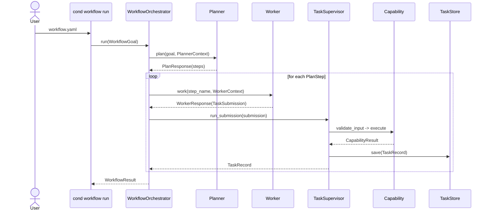

# Conductor Engine

<p align="center">
  <a href="https://github.com/DanSega1/Conductor-Engine/actions/workflows/ci.yml">
    
  </a>
  <a href="https://pypi.org/project/conductor-engine/">
    
  </a>
  <a href="https://pypi.org/project/conductor-engine/">
    
  </a>
</p>

<p align="center">
  
</p>

A minimal, installable orchestration runtime for task execution, capability loading, guardrails, storage abstractions, and future agent and policy layers.

## AI Collaboration

This project is AI-enhanced. A significant portion of the code, tests, and documentation was written with AI assistance as part of an intentional human-AI collaborative workflow.

## Roadmap Status

> `condor-tui` already exists; Phase 4 is focused on aligning it to stable, versioned engine control-plane contracts.

| Phase | Status | Focus |
| --- | --- | --- |
| [Phase 1: Core Runtime](docs/conductor/roadmap.md#phase-1--core-runtime-complete) | ✅ Complete | Single-process task execution, core capabilities, guardrails, local storage, and baseline CLI support. |
| [Phase 2: Workflow Layer](docs/conductor/roadmap.md#phase-2--workflow-layer-complete) | ✅ Complete | Planner, worker, validator, and orchestrator contracts over the existing supervisor path. |
| [Phase 3: Production Hardening](docs/conductor/roadmap.md#phase-3--production-hardening-complete) | ✅ Complete | Observability, policies, pluggable stores, approvals, and parallel workflow execution. |
| [Phase 4: Control Plane + TUI](docs/conductor/roadmap.md#phase-4--control-plane--tui-wip) | ✅ Complete | Versioned HTTP control-plane API (`engine/api/`), SSE event stream, multi-engine cluster routing, and `cond serve`. |
| [Phase 5: Autonomous Operation](docs/conductor/roadmap.md#phase-5--autonomous-operation-complete) | ✅ Complete | Self-enforcing policy, behavioral retry, cron/webhook triggers, sandboxed execution, require_approval gate, rich audit trail, and integration test suite. |
| [Phase 6: Guild Layer](docs/conductor/roadmap.md#phase-6--guild-layer) | Planned | Cross-project failure learning and role-scoped knowledge sharing. |
| [Phase 7: Remote Deployment and Protected Operation](docs/conductor/roadmap.md#phase-7--remote-deployment-and-protected-operation) | Planned | Protected remote operation, multi-tenant isolation, remote runners, and hardened deployment targets. |

> **Next:** Phase 6 — Guild Layer (cross-project failure learning and role-scoped knowledge sharing).

See the [full roadmap](docs/conductor/roadmap.md) for phase scope, rationale, and backlog details.

## Quick Start

```bash
python3.14 -m venv .venv
source .venv/bin/activate
pip install -e .
cond run examples/echo.yaml
cond workflow run examples/workflow-echo.yaml
```

Use `man cond` for the stable CLI reference, `cond help` for runtime-aware command and capability help, and `cond --help` for standard flag usage.

## HTTP API

The engine ships a full control-plane HTTP API built on FastAPI. Install the `[api]` extra and start the server:

```bash
pip install -e ".[api]"
cond serve                        # binds to 127.0.0.1:8080 by default
cond serve --host 0.0.0.0 --port 8080
```

Interactive docs are available at `http://localhost:8080/docs` once the server is running.

### Endpoint groups

| Group | Prefix | Notes |
|-------|--------|-------|
| Tasks | `GET/POST /v1/tasks` | List, submit, run inline, approve, cancel |
| Capabilities | `GET /v1/capabilities` | Registry browser |
| Workflows | `POST /v1/workflows` | Submit and run a workflow goal |
| Events | `GET /v1/events` | Server-Sent Events stream (filter by type) |
| Health | `GET /v1/health` | Component health; 503 on issues |
| Snapshot | `GET /v1/snapshot` | Full versioned `ControlPlaneSnapshotV1` |
| Cluster | `GET/POST /v1/engines` | Register nodes, heartbeat, tag-based routing |

### Multi-engine fleet

Register remote Conductor Engine instances as nodes and route tasks by tag constraints:

```bash
# Register a worker node
curl -X POST http://coordinator:8080/v1/engines \
  -H "Content-Type: application/json" \
  -d '{"name": "worker-gpu-01", "base_url": "http://10.0.0.5:8080", "tags": {"pool": "gpu", "region": "us-east-1"}}'

# Submit to best matching node
curl -X POST http://coordinator:8080/v1/engines/tasks/run \
  -H "Content-Type: application/json" \
  -d '{"name": "infer", "capability": "echo", "input": {}, "engine_tags": {"pool": "gpu"}}'
```

### SSE event stream

```bash
curl -N http://localhost:8080/v1/events
curl -N "http://localhost:8080/v1/events?types=task_completed,task_failed"
```

## Docker

A `Dockerfile` and `.dockerignore` are included at the repo root. The image uses `python:3.14-slim` on `linux/arm64` (Apple Silicon) and `linux/amd64`.

```bash
# Build
docker build -t conductor-engine:latest .

# Run
docker run -p 8080:8080 conductor-engine:latest
# API docs: http://localhost:8080/docs

# Pass a custom store path or capabilities config
docker run -p 8080:8080 \
  -v "$PWD/.conductor:/data" \
  conductor-engine:latest \
  cond serve --host 0.0.0.0 --port 8080 --store /data/tasks.json
```

## Architecture At A Glance



## What You Get

- Generic task contracts and a supervisor runtime that stays small and composable.
- Built-in `echo`, `filesystem`, `http`, and optional `memory` capabilities.
- A workflow layer with planner, worker, and validator interfaces over the same supervisor path.
- Local JSON task storage and an in-memory queue for straightforward local operation.
- A `cond` CLI with task execution, workflow execution, capability discovery, dynamic help, and native manpage support.
- A full FastAPI control-plane HTTP API (`engine/api/`) with SSE event streaming, versioned read models, control actions, and multi-engine cluster routing.
- A `Dockerfile` for containerised deployment on `arm64` and `amd64`.

## Docs And Examples

- [Examples](examples/README.md) for runnable tasks and workflows.
- Phase 3 examples: [workflow-parallel.yaml](examples/workflow-parallel.yaml) shows parallel fan-out with a barrier step, and [capability-execution-controls.yaml](examples/capability-execution-controls.yaml) shows per-capability execution controls for `cond --config`.
- [Roadmap](docs/conductor/roadmap.md) for phase planning and backlog tracking.
- [Architecture diagrams](docs/conductor/architecture-diagrams.md) for the full system view.
- [CLI reference](docs/conductor/cond-cli.md) for command-focused documentation.
- [PyPI project page](https://pypi.org/project/conductor-engine/) for published releases.

## Built With Conductor Engine

**[home-ai-control-plane](https://github.com/DanSega1/home-ai-control-plane)** is the motivating downstream system: a policy-governed, multi-agent AI control plane running on a Raspberry Pi 5 for personal digital workflows, home-lab services, and smart-home integrations.

See [the use case write-up](docs/conductor/use-cases/home-control-plane.md) for how the engine maps to that system.

## Development Notes

- Python support now targets `3.14+`.
- The repo convention is a single root virtualenv: `python3.14 -m venv .venv`.
- Coverage and license badges can be added once coverage reporting and license metadata are published in-repo.
