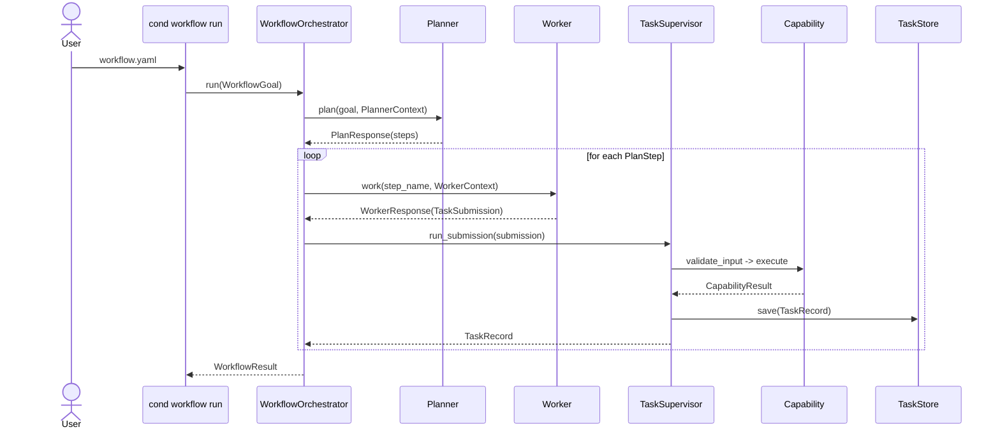

# Conductor Engine

<p align="center">
  <a href="https://github.com/DanSega1/Conductor-Engine/actions/workflows/ci.yml">
    
  </a>
  <a href="https://pypi.org/project/conductor-engine/">
    
  </a>
  <a href="https://pypi.org/project/conductor-engine/">
    
  </a>
</p>

<p align="center">
  
</p>

A minimal, installable orchestration runtime for task execution, capability loading, guardrails, storage abstractions, and future agent and policy layers.

## AI Collaboration

This project is AI-enhanced. A significant portion of the code, tests, and documentation was written with AI assistance as part of an intentional human-AI collaborative workflow.

## Quick Start

```bash
python3.14 -m venv .venv
source .venv/bin/activate
pip install -e .
cond run examples/echo.yaml
cond workflow run examples/workflow-echo.yaml
```

Use `man cond` for the stable CLI reference, `cond help` for runtime-aware command and capability help, and `cond --help` for standard flag usage.

## Architecture At A Glance



## What You Get

- Generic task contracts and a supervisor runtime that stays small and composable.
- Built-in `echo`, `filesystem`, `http`, and optional `memory` capabilities.
- A workflow layer with planner, worker, and validator interfaces over the same supervisor path.
- Local JSON task storage and an in-memory queue for straightforward local operation.
- A `cond` CLI with task execution, workflow execution, capability discovery, dynamic help, and native manpage support.

## Docs And Examples

- [Examples](examples/README.md) for runnable tasks and workflows.
- [Roadmap](docs/conductor/roadmap.md) for phase planning and backlog tracking.
- [Architecture diagrams](docs/conductor/architecture-diagrams.md) for the full system view.
- [CLI reference](docs/conductor/cond-cli.md) for command-focused documentation.
- [PyPI project page](https://pypi.org/project/conductor-engine/) for published releases.

## Built With Conductor Engine

**[home-ai-control-plane](https://github.com/DanSega1/home-ai-control-plane)** is the motivating downstream system: a policy-governed, multi-agent AI control plane running on a Raspberry Pi 5 for personal digital workflows, home-lab services, and smart-home integrations.

See [the use case write-up](docs/conductor/use-cases/home-control-plane.md) for how the engine maps to that system.

## Development Notes

- Python support now targets `3.14+`.
- The repo convention is a single root virtualenv: `python3.14 -m venv .venv`.
- Coverage and license badges can be added once coverage reporting and license metadata are published in-repo.
