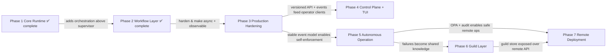
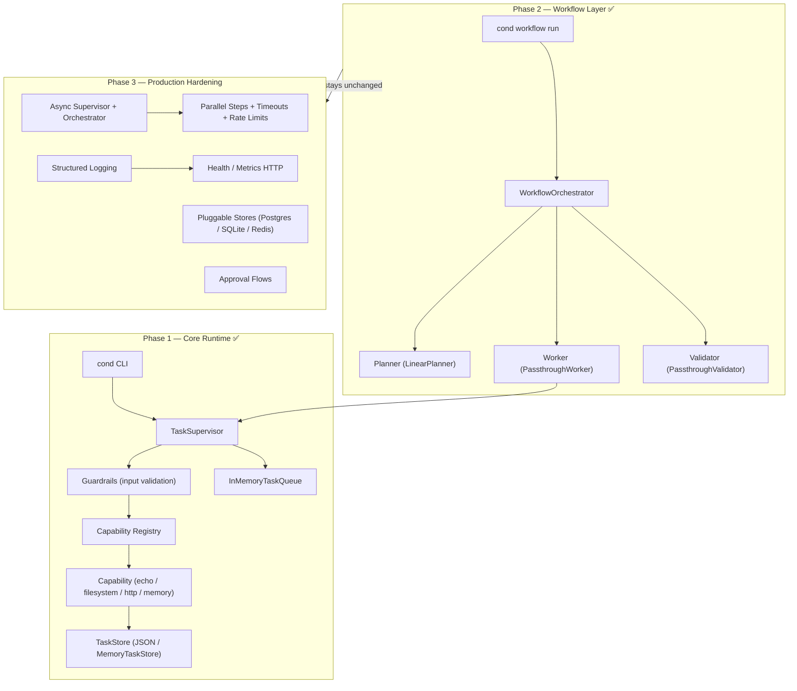
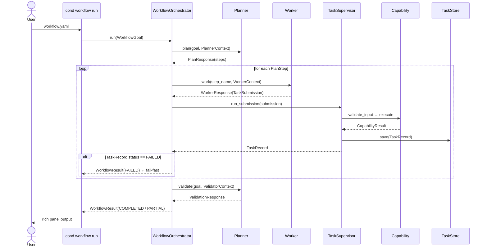
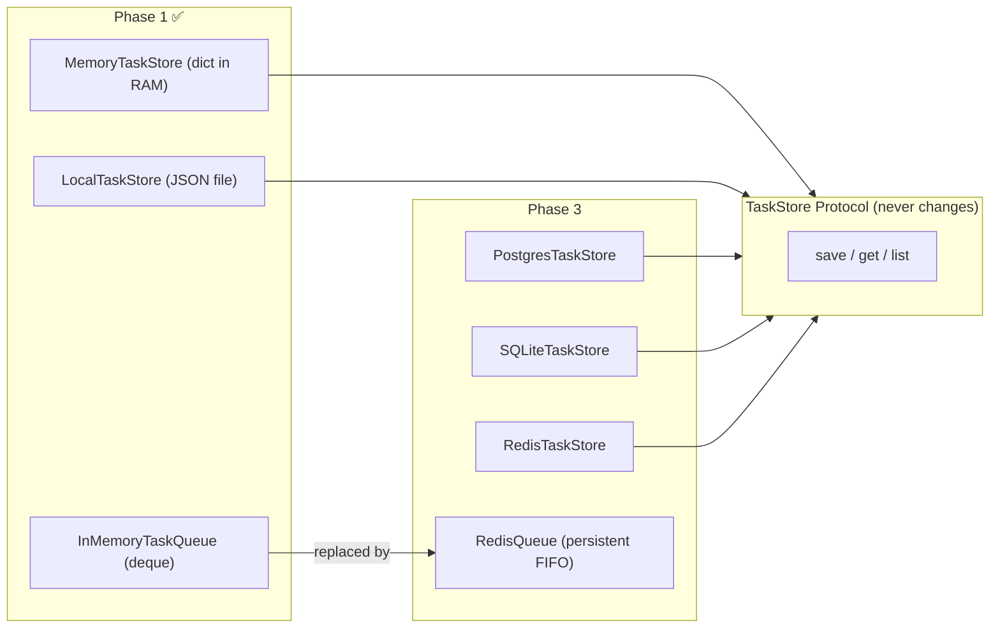
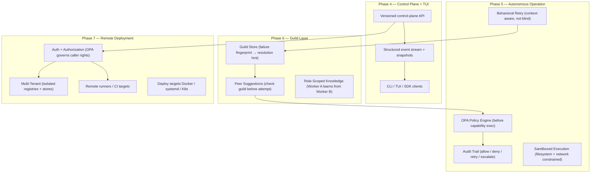
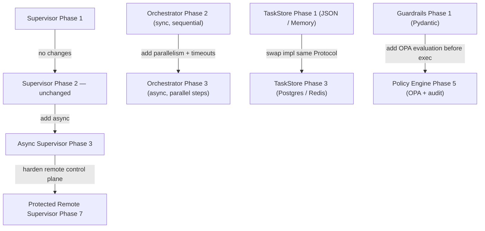

# Conductor Engine — Architecture Diagrams

Six diagrams covering the full system across all phases. Each diagram focuses on a different layer or concern.

---

## Diagram 1 — Phase Progression

How each phase builds on the previous one and what unlocks each transition.

---

## Diagram 2 — Execution Layer per Phase

What gets added to the execution stack at each phase. The supervisor is the fixed centre — everything else is added above or below it.

---

## Diagram 3 — Data Flow Inside a Workflow

Step-by-step sequence of a `cond workflow run` call from user input to terminal output.

---

## Diagram 4 — Storage Layer Evolution

How the storage layer evolves across phases. The `TaskStore` Protocol never changes — only the implementations are swapped.

---

## Diagram 5 — Security and Policy Layer

How the operator, policy, and trust model evolves from Phase 4 through Phase 7.

---

## Diagram 6 — Component Refinement Across Phases

Which components are carried forward unchanged, which are extended, and which are replaced.

