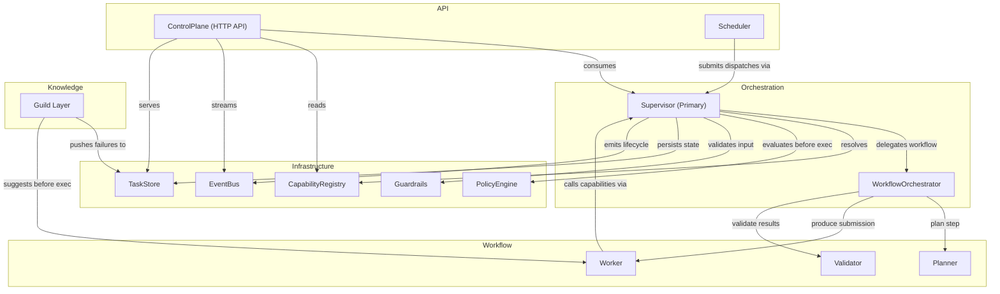
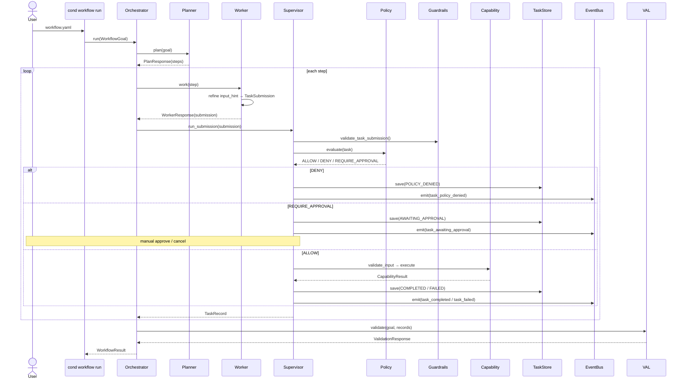

# OpenCode Agent Hierarchy

This directory documents the agent and subagent configuration in `.opencode/`, which mirrors the Conductor Engine's layered architecture. The agent hierarchy encodes the engine's runtime invariants, interface contracts, and phase progression into AI collaboration instructions — ensuring that any AI-assisted workflow respects the same boundaries the Python runtime enforces.

## Agent layers (top to bottom)

## Execution flow (workflow goal to result)

## Agent roles and responsibilities

| Agent | Engine ref | Priority | Role |
|---|---|---|---|
| supervisor | `engine/supervisor/service.py::TaskSupervisor` | 0 | Primary orchestrator. Only path capabilities execute through. |
| workflow-orchestrator | `engine/workflow/orchestrator.py::WorkflowOrchestrator` | 1 | Coordinates planner→worker→supervisor→validator. |
| planner | `engine/interfaces/workflow.py::PlannerInterface` | 2 | Breaks goals into ordered PlanSteps. Never executes. |
| worker | `engine/interfaces/workflow.py::WorkerInterface` | 3 | Turns PlanSteps into TaskSubmissions. |
| validator | `engine/interfaces/workflow.py::ValidatorInterface` | 4 | Assesses workflow results (pass/fail). |
| capability-registry | `engine/registry/capabilities.py::CapabilityRegistry` | 5 | Manages built-in and plugin capabilities. |
| policy-engine | `engine/interfaces/policy.py::PolicyEngine` | 6 | Evaluates tasks before execution. |
| guardrails | `engine/guardrails/validation.py` | 7 | Validates input schema and path safety. |
| task-store | `engine/runtime/store.py::TaskStore` | 8 | Persists TaskRecords at every transition. |
| event-bus | `engine/interfaces/event.py::EventBus` | 9 | Fire-and-forget lifecycle event emission. |
| control-plane | `engine/api/` | 10 | Versioned HTTP FastAPI API surface. |
| scheduler | `engine/runtime/scheduler.py` | 11 | Cron/webhook trigger polling and dispatch. |
| guild | `docs/conductor/roadmap.md#phase-6--guild-layer` | 12 | Cross-project failure knowledge sharing. |

## Subagent catalog

### planner
| Subagent | Engine ref | Purpose |
|---|---|---|
| linear-planner | `engine/workflow/agents/linear_planner.py` | Deterministic ordered-step planner (no LLM). |

### worker
| Subagent | Engine ref | Risk | Purpose |
|---|---|---|---|
| passthrough-worker | `engine/workflow/agents/passthrough_worker.py` | — | Passes input_hint directly as submission input. |
| echo-capability | `engine/capabilities/echo.py` | low | Returns input as output. Smoke tests. |
| filesystem-capability | `engine/capabilities/filesystem.py` | high | Read/write/delete/list files. Path-protected. |
| http-capability | `engine/capabilities/http.py` | medium | HTTP client (GET, POST, PUT, DELETE). |
| memory-capability | `engine/capabilities/memory.py` | low | In-memory KV store between workflow steps. |
| mcp-capability | `engine/capabilities/mcp.py` | medium | MCP executor wrapper (transport in conductor-mcp). |

### validator
| Subagent | Engine ref | Purpose |
|---|---|---|
| passthrough-validator | `engine/workflow/agents/passthrough_validator.py` | Always passes. Default stub. |

### policy
| Subagent | Engine ref | Purpose |
|---|---|---|
| null-policy | `engine/runtime/policy.py::NullPolicyEngine` | Always ALLOWs. Safe default. |
| opa-policy | `engine/runtime/policy.py::OPAPolicyEngine` | Queries external OPA server with Rego policies. |
| risk-level-policy | `engine/runtime/policy.py::RiskLevelPolicyEngine` | Deny/approve based on capability risk level threshold. |

### store
| Subagent | Engine ref | Purpose |
|---|---|---|
| memory-store | `engine/runtime/store.py::MemoryTaskStore` | In-memory dict. Tests and embedded runs only. |
| json-store | `engine/runtime/store.py::LocalTaskStore` | File-based JSON persistence. Single-node. |
| postgres-store | `engine/runtime/store.py::PostgresTaskStore` | PostgreSQL. ACID. Production multi-node. |
| redis-store | `engine/runtime/store.py::RedisTaskStore` | Redis. Fast in-memory with optional snapshot. |

### event-bus
| Subagent | Engine ref | Purpose |
|---|---|---|
| null-event-bus | `engine/runtime/bus.py::NullEventBus` | No-op. Default. |
| logging-event-bus | `engine/runtime/bus.py::LoggingEventBus` | Writes events to structured logs. |
| sse-event-bus | `engine/api/bus.py::SSEEventBus` | Bridges sync events to async SSE clients. |

### retry
| Subagent | Engine ref | Purpose |
|---|---|---|
| default-retry | `engine/runtime/retry.py::DefaultRetryStrategy` | Simple attempt cap. Escalation threshold. |
| exponential-backoff-retry | `engine/runtime/retry.py::ExponentialBackoffRetryStrategy` | 2^n delay. Transient failures. |
| jittered-backoff-retry | `engine/runtime/retry.py::JitteredBackoffRetryStrategy` | Backoff + random jitter. Avoids thundering herd. |
| input-adjusting-retry | `engine/runtime/retry.py::InputAdjustingRetryStrategy` | Modifies input per retry attempt. |

### triggers
| Subagent | Engine ref | Purpose |
|---|---|---|
| cron-trigger | `engine/runtime/scheduler.py::CronTriggerAdapter` | Cron expression match. |
| webhook-trigger | `engine/runtime/scheduler.py::WebhookTriggerAdapter` | Maps webhook payloads to TaskSubmissions. |
| scheduler-service | `engine/runtime/scheduler.py::TriggerSchedulerService` | Polls adapters, submits dispatches, lifecycle. |
| webhook-ingress | `engine/runtime/scheduler.py::WebhookIngressService` | Decodes HTTP requests, routes to adapters. |

### sandbox
| Subagent | Engine ref | Purpose |
|---|---|---|
| subprocess-runner | `engine/runtime/sandbox.py::SubprocessCapabilityRunner` | Isolated child-process exec. Hard timeout. |

### guild
| Subagent | Engine ref | Purpose |
|---|---|---|
| failure-knowledge-base | Phase 6 | Stores (capability + error fingerprint) → resolution hint. |
| peer-suggestions | Phase 6 | Checks guild KB before execution. Returns hints. |
| role-knowledge | Phase 6 | Role-scoped knowledge across projects. |

## Enforced invariants

These invariants from `docs/conductor/design-integrity.md` are encoded as agent instructions in every relevant agent config:

| # | Invariant | Enforced in |
|---|---|---|
| 1 | Supervisor is the only path through which a capability executes | supervisor, orchestrator, worker |
| 2 | Guardrails run before a task leaves PENDING | supervisor, guardrails |
| 3 | Task state persisted at every transition | supervisor, store |
| 4 | Capabilities are stateless (no shared mutable state) | worker (capability subagents) |
| 5 | Path traversal rejected at filesystem boundary | guardrails, filesystem-capability |
| 6 | EventBus is injected, never hardcoded | supervisor, event-bus |
| 7 | Store reads return deep copies | store, all store subagents |
| 8 | Failure context durable and observable before retry | supervisor, retry subagents |
| 9 | ESCALATED is terminal — never transition back to RUNNING | supervisor |

## Benefits of this hierarchy

### 1. Invariant enforcement at the AI level
Every agent config hard-codes the same invariants the Python runtime enforces. AI-assisted code generation, review, or triage will respect these boundaries because they're part of the agent's system instructions.

### 2. Role isolation
Planner agents cannot execute capabilities. Worker agents cannot make policy decisions. Validator agents cannot modify tasks. This mirrors the `engine/interfaces/` separation in Python.

### 3. Delegation clarity
Each agent's `delegates_to` field makes the call graph explicit. If you need to understand who calls what, the agent manifest is the source of truth.

### 4. Pluggable backends without config changes
Store backends (memory → json → postgres → redis) and policy engines (null → OPA → risk-level) are swapped at the subagent level. The agent role interface never changes.

### 5. Phase progression mapped
The agent hierarchy grows as the engine phases progress:
- Phase 1–2: supervisor, orchestrator, planner, worker, validator, registry, guardrails, store
- Phase 3: policy, event-bus, approval flows
- Phase 4: control-plane
- Phase 5: scheduler, retry strategies, sandbox, escalation
- Phase 6: guild layer

### 6. Audit trail for AI decisions
Every lifecycle transition emits a structured event. The agent instructions mandate this — AI-assisted workflows will document their decisions the same way the engine does.

## How to use

### Selecting an agent
The supervisor is the primary agent. To invoke a specific role:

- `cond workflow run` → orchestrator agent (delegates to planner → worker → supervisor)
- `cond run` → supervisor agent (direct submission path)
- API server → control-plane agent (wires supervisor + registry + event-bus)

### Adding a new capability
1. Create the capability implementation in `engine/capabilities/`
2. Register it in `engine/registry/capabilities.py`
3. Add a subagent config in `.opencode/subagents/worker/`
4. Add it to the worker agent's `subagents` list

### Swapping a store backend
1. Create the store implementation in `engine/runtime/store.py`
2. Add a subagent config in `.opencode/subagents/store/`
3. Add it to the store agent's `subagents` list

### Adding a policy engine
1. Implement `PolicyEngine` protocol in `engine/runtime/policy.py`
2. Add a subagent config in `.opencode/subagents/policy/`
3. Add it to the policy agent's `subagents` list

## Reference

- `.opencode/opencode.json` — project root config with custom instructions
- `.opencode/agents.json` — main agent manifest (13 agents, 27 subagents)
- `docs/conductor/design-integrity.md` — cross-phase invariants
- `docs/conductor/architecture-diagrams.md` — system architecture
- `engine/interfaces/` — Python protocol definitions each agent mirrors
